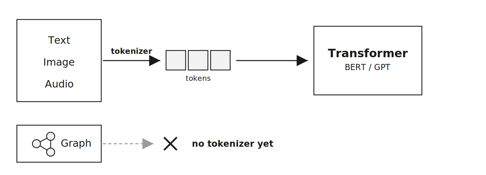
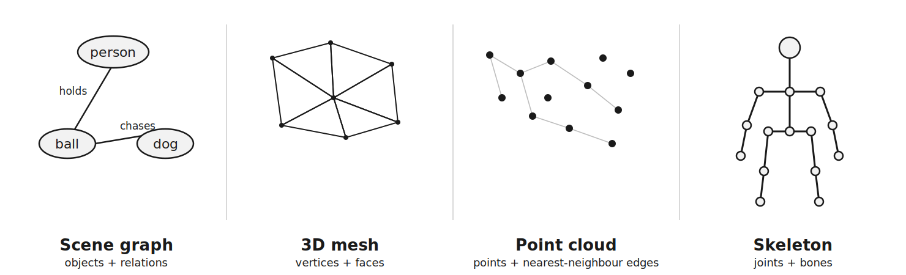
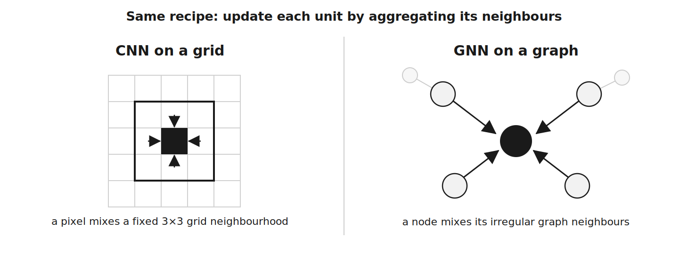
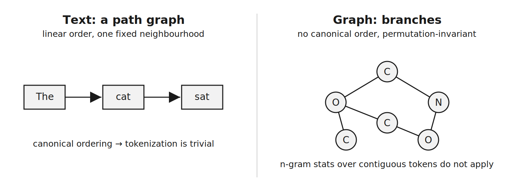
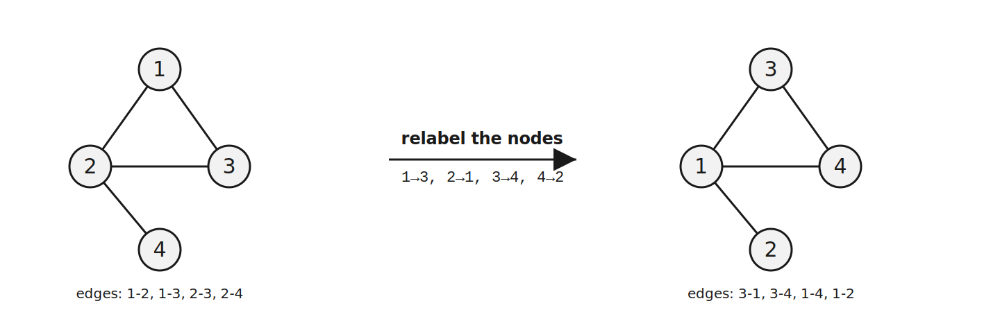
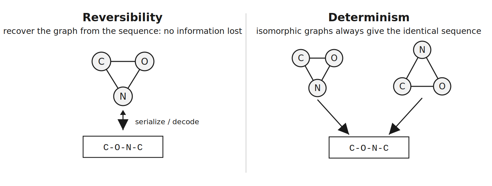
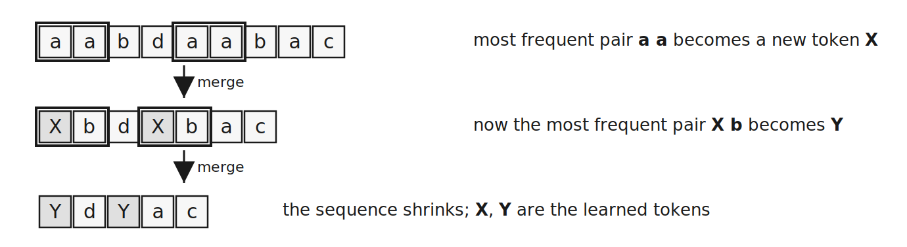
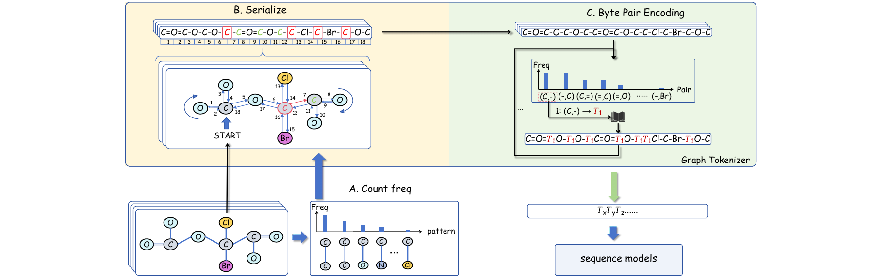
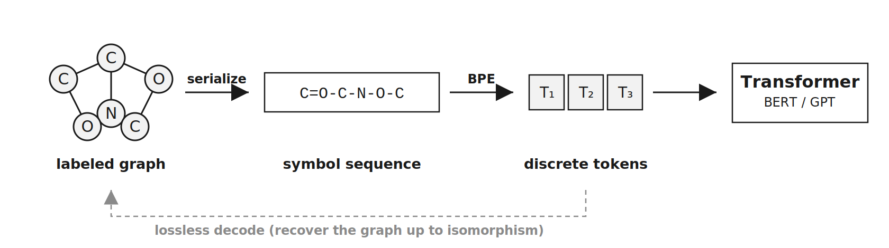

## Study Note: Graph Tokenization

My reading notes on <em>Graph Tokenization for Bridging Graphs and Transformers</em> (Zeyuan Guo, Enmao Diao, Cheng Yang, Chuan Shi — BUPT / DreamSoul, ICLR 2026). The framing and figures here are my own study aids for the paper; the method is theirs.

Over the last few years one architecture quietly became the default across machine learning — the **Transformer**, and the large language models built on it. What is easy to miss is *how* each kind of data got to ride that wave. Text, images, audio: every modality made the same jump, and it made it through the same door. This note is about the one modality that never found the door — the **graph** — and a recent paper's answer for how to build it.

### Every modality joined the Transformer era through a tokenizer

<figure class="note-fig">
  
  <figcaption><strong>The tokenizer is the bridge.</strong> Text, images, and audio each cross into the Transformer by being tokenized. Graphs have no standard tokenizer, so they cannot make the jump.</figcaption>
</figure>

The recipe is always the same. A **tokenizer** turns raw input into discrete **tokens** — subword units for text, image **patches** for a Vision Transformer, codec tokens for audio. Once the data *is* tokens, it inherits the entire ecosystem: pretraining, scaling laws, and one shared toolbox that everyone improves together. The tokenizer is not a detail; it is the bridge that lets a modality enter the party at all.

### One kind of data sat the revolution out: graphs

One common data type never got that tokenizer: the **graph**. And graphs are everywhere — molecules, social and citation networks, and a surprising amount of **computer vision**. We *can* learn on them, but only with a **separate, graph-specific toolbox**, sitting apart from the sequence models that took over everything else. Graphs ended up on their own island, outside the Transformer and LLM ecosystem.

<figure class="note-fig">
  
  <figcaption><strong>Graphs are all over vision.</strong> Four everyday representations that are graphs at heart — scene graphs, 3D meshes, point clouds, and skeletons.</figcaption>
</figure>

The vision connection is worth dwelling on, because it is where I care most. **Scene graphs** make objects the nodes and their relations ("holds", "on top of") the labeled edges — the backbone of visual reasoning and captioning. **3D meshes** make vertices the nodes and triangular faces the edges — the standard surface representation for shapes, scenes, and avatars. **Point clouds and skeletons** — LiDAR or depth points, and human-pose joints — become graphs through nearest-neighbour or bone connectivity. If you work in 3D vision, you are already working with graphs; you just do not get to use the Transformer toolbox on them directly.

### GNNs: the graph cousin of the CNN

<figure class="note-fig">
  
  <figcaption><strong>CNN vs. GNN.</strong> Both update a unit from its neighbours — the CNN over a fixed grid window, the GNN over a node's irregular graph neighbourhood.</figcaption>
</figure>

The standard tool on that island is the **Graph Neural Network (GNN)**, and the cleanest way to understand it is as a CNN that fell off the grid. A GNN learns by **message passing**: each node repeatedly gathers feature vectors from its neighbours and updates its own. Stack a few layers and every node has "seen" its local neighbourhood. That is exactly a **convolution off the grid** — a CNN mixes a pixel with a fixed 3×3 window; a GNN mixes a node with whatever neighbours the graph happens to give it. The catch is that GNNs are a **bespoke stack** (custom layers, pooling, positional tricks), separate from the Transformers that now dominate text, vision, and audio. Every advance in sequence modeling has to be re-invented before it reaches graphs.

### Two ways to put Transformers on graphs — both compromise

There have been two obvious attempts to close the gap, and each one gives something up:

- **(a) Change the architecture.** Bake attention into GNNs to build specialized **Graph Transformers**. This needs graph-specific designs that **diverge from standard sequence models**, so every improvement in the mainstream has to be ported over by hand.
- **(b) Embed into continuous vectors.** Project graph structure into the embedding space of a pretrained model. This tends to be lossy or unstable, and performance hinges on **cross-modal alignment** — information is discarded before the model even starts.

> Neither gives a clean, lossless, off-the-shelf interface. That gap is exactly what a real graph *tokenizer* should fill.

### Why graphs resist tokenization

<figure class="note-fig">
  
  <figcaption><strong>Text vs. graph.</strong> Text is a path graph with one fixed order; a general graph branches and has no canonical ordering.</figcaption>
</figure>

So why not just tokenize a graph the way we tokenize text? Because **text is a secretly easy graph** — a *path graph*, with a single linear order and one fixed neighbourhood. Tokenization there is straightforward. General graphs break both assumptions at once: neighbourhoods **branch**, and there is **no canonical order** — any permutation of the nodes is the *same* graph, so the n-gram statistics that BPE relies on over contiguous text simply do not apply. The paper's key move is to split the problem in two: first **serialize** the graph into a symbol sequence, then **tokenize that sequence like text** — provided the serialization is reversible and deterministic. Everything hard lives in that proviso.

### Preliminaries — the two properties a serialization must have

Before the method, two ideas from the paper are worth pinning down, because the whole design is built to satisfy them.

<figure class="note-fig">
  
  <figcaption><strong>Permutation invariance.</strong> Renumbering the nodes leaves every edge intact, so it is the same graph — the node indices are arbitrary.</figcaption>
</figure>

A **labeled graph** carries a label from some alphabet on every node and edge (for a molecule: atom types and bond types). The trap is **permutation invariance**: the numbering of the nodes is arbitrary. Permute the labels and every edge still joins the same pair, so the graph is unchanged. Two graphs related by such a relabeling are **isomorphic** — the *same* graph. A tokenizer therefore has a hard constraint: it must produce the **same output for every graph in an isomorphism class**.

<figure class="note-fig">
  
  <figcaption><strong>The two properties.</strong> Reversibility recovers the graph from the sequence; determinism gives every isomorphic copy the identical sequence.</figcaption>
</figure>

That constraint sharpens into two properties a serialization must have at once:

- **Reversibility** — the graph can be recovered from the sequence up to isomorphism, so **no information is lost**.
- **Determinism** — the same graph always maps to the same sequence, so the output is **stable across node permutations**.

Either one alone is easy. Satisfying **both at the same time** for general graphs is the core challenge, and it is what the method is engineered around.

### Preliminaries — how BPE learns a vocabulary

<figure class="note-fig">
  
  <figcaption><strong>Byte Pair Encoding.</strong> Each round merges the most frequent adjacent pair into a new token — the sequence shrinks and the vocabulary grows.</figcaption>
</figure>

The other ingredient is **Byte Pair Encoding (BPE)**, the data-driven tokenizer behind most LLMs. It starts from base symbols and repeatedly **merges the most frequent adjacent pair** into a new token. Frequent patterns collapse into short, meaningful tokens; rare ones stay split. The precondition is the part that matters for graphs: **BPE only discovers a unit if it shows up as a frequent, *adjacent* pair.** Whatever structure you want the vocabulary to capture, the serialization has to have already placed it side by side.

### Method — serialize, then tokenize with BPE

<figure class="note-fig">
  
  <figcaption><strong>The GraphTokenizer framework.</strong> (A) count substructure frequencies over the training graphs; (B) frequency-guided, reversible serialization; (C) BPE learns a vocabulary on the serialized corpus.</figcaption>
</figure>

The proposed **GraphTokenizer** composes a serialization *f* with a BPE tokenizer *T*: **Φ = T ∘ f**. The important design choice is that all the structure lives in the **tokenizer**, not the model. The output is a plain token sequence you can feed to a standard sequence model, and decoding just runs the inverse **f⁻¹ ∘ T⁻¹** — tokens back to graph. Concretely it is three steps:

- **Step 1 — measure what is common.** Over the training set, count small **labeled-edge patterns** (source label, edge, target label) and normalize them into a **frequency map** *F*. It is cheap, permutation-invariant, and serves as a reliable tie-breaker later.
- **Step 2 — serialize reversibly *and* deterministically.** Walk an **edge-covering traversal** (an Eulerian circuit, or a Chinese-Postman walk when no Eulerian circuit exists), which makes the serialization reversible. At each branch, take the edge whose pattern is **most frequent** under *F*, with lexical rules to break ties. That makes it deterministic — and, as a bonus, it lands frequent substructures **adjacent** in the sequence.
- **Step 3 — learn the vocabulary with BPE.** Run BPE on the serialized corpus. Because Step 2 already placed frequent substructures side by side, each merge is not arbitrary compression but a **recoverable subgraph fragment**. The learned vocabulary is *structurally informed* — the tokens mean something on the graph.

The elegance is in how the three steps interlock: the frequency map from Step 1 is what makes Step 2's traversal deterministic, and Step 2's adjacency is the precondition BPE needed in Step 3.

### The result — a reversible bridge into any Transformer

<figure class="note-fig">
  
  <figcaption><strong>The bridge.</strong> Encoding is one preprocessing step and decoding inverts it, so the graph is recovered up to isomorphism while the model stays a standard Transformer.</figcaption>
</figure>

The mapping is **bidirectional** — ENCODE (graph → tokens) and DECODE (tokens → graph) — so nothing is lost along the way. And because the output is just a token sequence, it feeds any backbone unchanged: **BERT** for classification and regression (prepend `[CLS]`, pool), **GPT** for generation, an **LLM** for graph summarization.

> Graph learning becomes sequence modeling: it inherits long context, efficient attention, and scaling — with no graph-specific architecture.

That is the part I find compelling. The bet is not a better graph model; it is that the *right interface* lets graphs stop reinventing the wheel and simply ride the sequence-modeling curve everyone else is already on.

