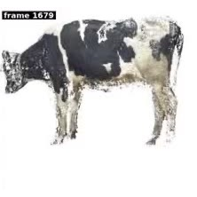
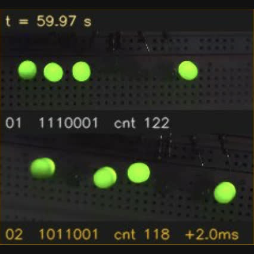

<table style="width:100%;border:0px;border-spacing:0px;border-collapse:separate;margin-right:auto;margin-left:auto;">
  <tr>
    <td colspan="2" style="padding:1% 2.5%;vertical-align:middle">
      <h2>Projects</h2>
    </td>
  </tr>
  <tr class="proj-row">
    <td class="proj-img" style="padding:1% 2.5%;width:25%;vertical-align:middle;min-width:120px">
      
    </td>
    <td class="proj-text" style="padding:1% 2.5%;width:75%;vertical-align:middle">
      <h3><a href="/motion-capture.html">Motion Capture and 3D Reconstruction</a></h3>
      

      A fully mobile, markerless motion-capture rig of eleven synchronized smartphones for high-fidelity 3D reconstruction in the wild, with cattle reconstruction, human pose, and IMU motion-capture demos.
      

    </td>
  </tr>
  <tr class="proj-row">
    <td class="proj-img" style="padding:1% 2.5%;width:25%;vertical-align:middle;min-width:120px">
      
    </td>
    <td class="proj-text" style="padding:1% 2.5%;width:75%;vertical-align:middle">
      <h3><a href="https://yuboshell.github.io/led-sync-panel/report.html" target="_blank" rel="noopener">LED Timecode Panel</a></h3>
      

      A DIY LED timecode panel that stamps a per-frame binary code into every camera's view, for measuring multi-camera synchronization to sub-millisecond precision (the capture rig behind the Pixel-7 sync-evaluation project).
      

    </td>
  </tr>
</table>

<table style="width:100%;border:0px;border-spacing:0px;border-collapse:separate;margin-right:auto;margin-left:auto;">
  <tr>
    <td colspan="2" style="padding:1% 2.5%;vertical-align:middle">
      <h2>Publications</h2>
    </td>
  </tr>

  
  <tr class="proj-row">
    <td class="proj-img" style="padding:1% 2.5%;width:25%;vertical-align:middle;min-width:120px">
      
      
      
    </td>
    <td class="proj-text" style="padding:1% 2.5%;width:75%;vertical-align:middle">
      <h3><a href="{{ link.pdf }}" target="_blank" rel="noopener">{{ link.title }}</a>{{ link.title }}</h3>
      

        {{ link.authors }} 
        <em>{{ link.conference }}</em>
      

      

         / <a href="{{ link.code }}" target="_blank" rel="noopener">Code</a>
         / <a href="{{ link.page }}" target="_blank" rel="noopener">Project Page</a>
         / <a href="{{ link.bibtex }}" target="_blank" rel="noopener">BibTeX</a>
         <strong><i>{{ link.notes }}</i></strong>
      

    </td>
  </tr>
  

</table>

  
<h2 style="display:inline; margin:0;">Blogs</h2>

  

    <h3><a href="/how-to-be-good-at-research.html">Study Note: How to Be Good at Research</a></h3>
    

    Notes on choosing a research problem, from John Schulman's guide to ML research: work backward from an outcome you actually want, and let a goal you care about pull you into territory no survey paper covers. <em>July 2026.</em>
    

    <h3><a href="/graph-tokenization.html">Study Note: Graph Tokenization</a></h3>
    

    Reading notes on <em>Graph Tokenization for Bridging Graphs and Transformers</em> (Guo et al., ICLR 2026): why graphs never got a tokenizer, and how serializing a graph reversibly and deterministically lets a plain Transformer read it. <em>June 2026.</em>
    

    <h3><a href="https://huangyubo.gitlab.io/agent-native-lab/" target="_blank" rel="noopener">The Lab Management Workflow Revolution</a></h3>
    

    How a research lab can become agent-native, starting from one agent that already works: the friction in a typical lab workflow, and a first implemented step, a Lab Inventory Agent. <em>June 2026.</em>
    

  

